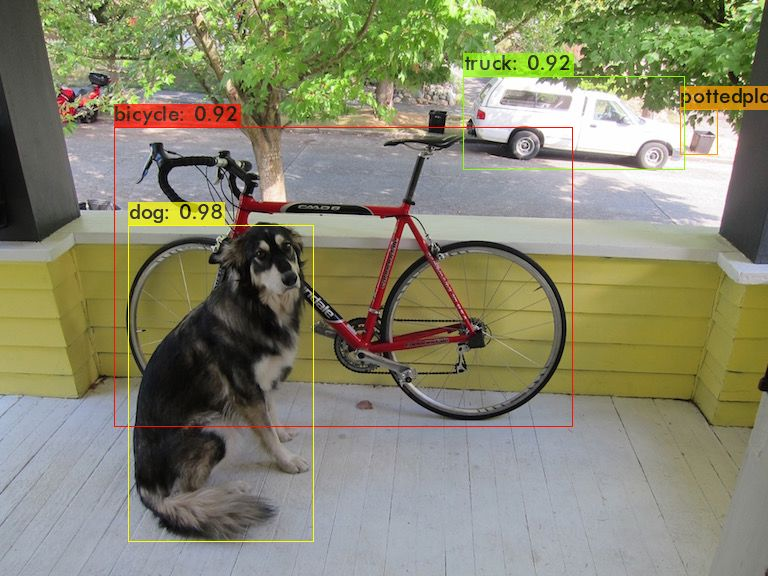

# YOLOv4_windows


### what is YOLO? :confused:
YOLO **You Only Look Once** real-time object detection alogorithm.
[read more...](https://medium.com/@ODSC/overview-of-the-yolo-object-detection-algorithm-7b52a745d3e0)

### Requirements
- CMake>= 3.18: (https://cmake.org/download/) `or` pip install CMAKE
- Powershell \(already installed on windows\):
- CUDA >= 10.2 (https://developer.nvidia.com/cuda-downloads)
- OpenCV >= 2.4
- cuDNN >= 8.0.2 (https://developer.nvidia.com/cudnn)

### How to compile on Windows \(using `vcpkg` \)

This is the recommended approach to build Darknet on Windows.

1. Install Visual Studio 2017 or 2019. [Visual Studio Community](https://visualstudio.microsoft.com/vs/community/)

2. Open Powershell \(Start -> All program -> Windows Powershell\)

```

PS Code/> git clone http://github.com/AlexeyAB/darknet
PS Code/> cd darknet
PS Code/> .\build.ps1 -UseVCPKG -EnableOPENCV -EnableCUDA -EnableCUDNN

```

#### Above processs takes time... 
#### be patient please :sweat_smile:

After successfull completion search for the file `image_yolov4` in your darknet file.

Double click on it or you can paste this code in your Powershell ` ./darknet detector test ./cfg/coco.data ./cfg/yolov4.cfg ./yolov4.weights data/dog.jpg -i 0 -thresh 0.25 `

#### Output image




#### courtesy 
[AlexeyAB/darknet](https://github.com/AlexeyAB/darknet#how-to-compile-on-windows-using-cmake)

